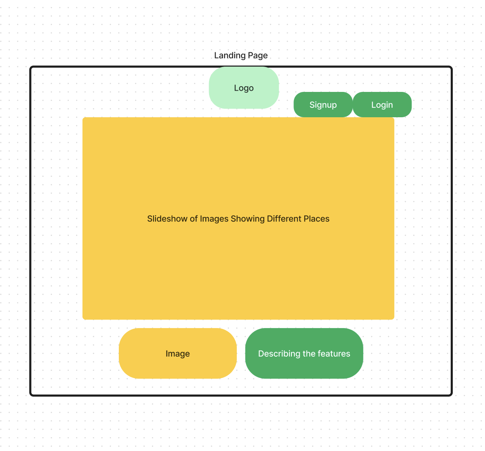
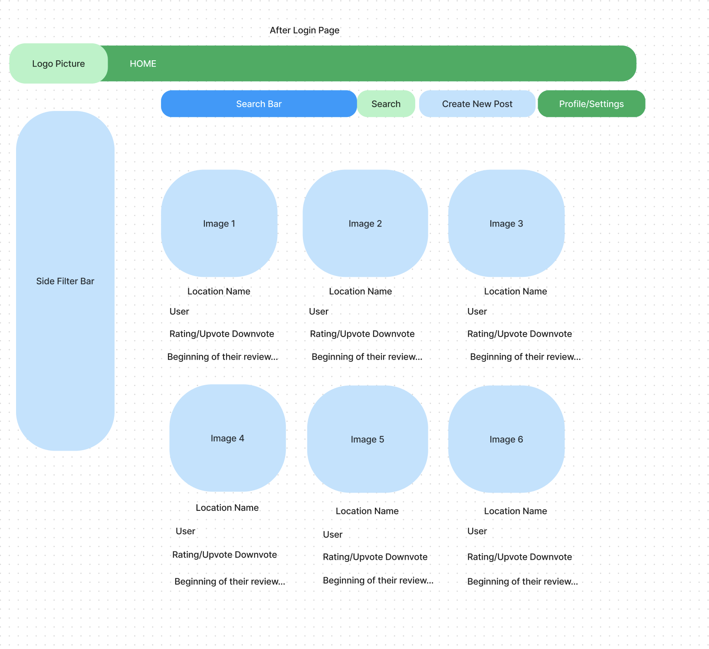

# UI Design

## Wireframe

These are two of the Wireframe Designs our team has come up with for our web application. These were created using Figma.

This is our landing page. The idea is to have the logo/name of our website at the top and for users to have the option to sign up for our website or log in to an already existing account. Below that we plan to have a slideshow of images showing different travel pictures from all over the world. Below the slideshow, we may have some sample images of places and descriptions of places for users to get a sense of what our website is about.

This second page can be accessed after the user signs up or logs in to an account. After a user logs in, they will be able to make a new post and access/change the settings of their profile. We plan to have a navigation bar at the top with our logo and a HOME button. Users will also be able to search for specific places they have in mind if interested. We also have a side filter bar that will filter results by the type of place it is, location, highest ratings, etc. Each result will show up as an image with the location name, the name of the user who posted, an ability to upvote or downvote the post, and the beginning of their review. 
## Stories

### Story 1

Clicking the link for our site will land you on the Homepage. This is where you will learn about the features that our site offers and what it's all about. On the Top right hand corner, you will find the login button which will open up an interface for you to sign in or create a new account. If you wish to enter the site without creating an account you can do so as a guest, but that would limit how you can interact with the site. On the homepage you will witness some of the amazing locations our users have been to in a slide-show like fashion and as you scroll down you will find pictures and information displayed regarding these features.

### Story 2

Upon signing in with your own account or as a guest, you will find yourself on our Home Screen User Interface. Some features include a search bar, posts, interactive buttons and a sidebar. The search bar is pretty straight forward, you can search for other users on our platform or look up locations so that you find posts and reviews for places in that location. The most important feature is that users can create posts. So basically a post would contain a few elements, The location name, a Photo(s) of the location/destination allowing a way for the user to express their experience, then a review by the user to tell a story of their journey at said location. Other users who view a post have the ability to upvote or downvote a post as well as leave a comment regarding the post.

### Story 3

A user can simply click on the ‘My Profile’ Button, to access their own profile and scroll through every single post that they have ever created, find their follower list as well as who follows them.
There will be a button that would also allow you to create a new post. The navigation bar would let users filter posts based on country, type of location (scenic,historic etc) and popularity.

## References

- [Link 1](https://getbootstrap.com/docs/5.3/getting-started/introduction/)
- [Link 2](https://unsplash.com/)